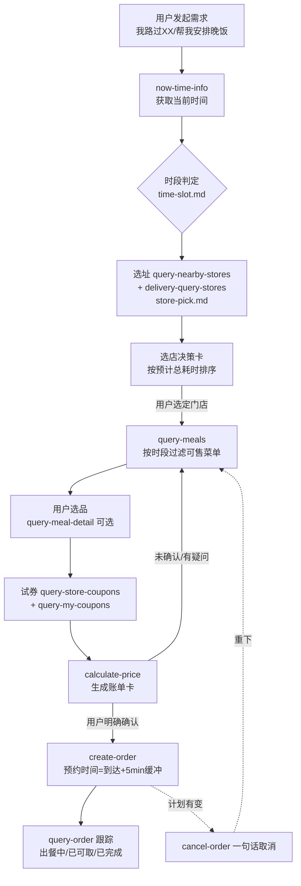
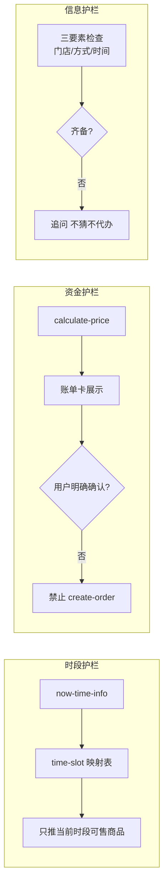

# 架构说明 — 麦麦路上 McDrive Mate

> 本项目是纯 Skill 形态（提示词 + MCP 工具编排），**没有自建后端服务**。所有业务能力由麦当劳官方 MCP Server 提供，所有决策逻辑由 WorkBuddy 智能体在对话中执行。
> 本文描述 Skill 的决策架构、模块划分与工具编排。

## 1. 总体架构

三层职责：

| 层 | 承担者 | 职责 |
|---|---|---|
| 交互层 | WorkBuddy 智能体 | 对话管理、上下文记忆（路线/老样子）、语音输入 |
| 决策层 | SKILL.md + 3 个 prompt 片段 | 时段映射、按总耗时选店、下单安全检查 |
| 能力层 | 麦当劳 MCP Server（16 个 Tool） | 门店/菜单/券/计价/订单/积分的真实业务操作 |

**设计取舍**：不做自建服务，意味着没有部署成本、没有用户数据落地（隐私友好）、Skill 逻辑全部开源可审计——这对参赛项目是优势而非限制。

## 2. 主决策流程

对应源码：

- 主流程规则：[skills/mcdrive-mate/SKILL.md](../skills/mcdrive-mate/SKILL.md) §3
- 时段判定：[prompts/time-slot.md](../skills/mcdrive-mate/prompts/time-slot.md)
- 选店排序：[prompts/store-pick.md](../skills/mcdrive-mate/prompts/store-pick.md)
- 下单安全：[prompts/order-flow.md](../skills/mcdrive-mate/prompts/order-flow.md)

## 3. 三条安全护栏（决策层核心设计）

| 护栏 | 解决的问题 | 定义位置 |
|---|---|---|
| 时段护栏 | 防止"早餐档推巨无霸"的心智错位 | SKILL.md 原则 2 |
| 资金护栏 | 防止 AI 擅自下单扣款；金额异常(>50%偏差)强制中断 | SKILL.md 原则 3 / order-flow.md 安全红线 |
| 信息护栏 | 防止替用户做"他没说过的决定" | SKILL.md 原则 6 |

## 4. 工具调用频控与复用策略

MCP Token 限流 600 次/分钟，Skill 内的节流设计：

1. **菜单复用**：同一门店的 `query-meals` 结果在会话上下文中缓存复用，改菜不重查
2. **合并查询**：试券环节 `query-store-coupons` + `query-my-coupons` 一次并行发出
3. **按需调用**：`query-meal-detail` 仅在用户追问套餐内容时调用；`query-my-account` 仅在速览卡场景调用
4. **取消零成本**：`cancel-order` 不做任何前置追问，直接执行

## 5. 与其他方案的对比（为什么是"纯 Skill"）

| 方案 | 部署成本 | 数据隐私 | 可维护性 | 本项目选择 |
|---|---|---|---|---|
| 自建后端 + 调 MCP | 需服务器/域名 | 用户数据经手第三方 | 双层维护 | ❌ |
| 纯 Skill（提示词编排） | 零 | 对话即用即走 | 改 markdown 即生效 | ✅ |
| 本地 MCP 聚合服务 | 需常驻进程 | 本地可控 | 需编码+发版 | ❌（P2 若做天气联动再评估） |

## 6. 演进路线

- **v0.x（当前）**：单会话、单路线，四项 P0 能力
- **v1.0**：P1 速览卡（`query-my-account`/`campaign-calendar`）+ 常用路线记忆（`order-list` 驱动复购）
- **v2.0（评估中）**：天气×路况联动。需要引入第三方数据源，将评估以「本地 MCP 聚合」或「WorkBuddy 插件」形式接入，届时更新本文档
